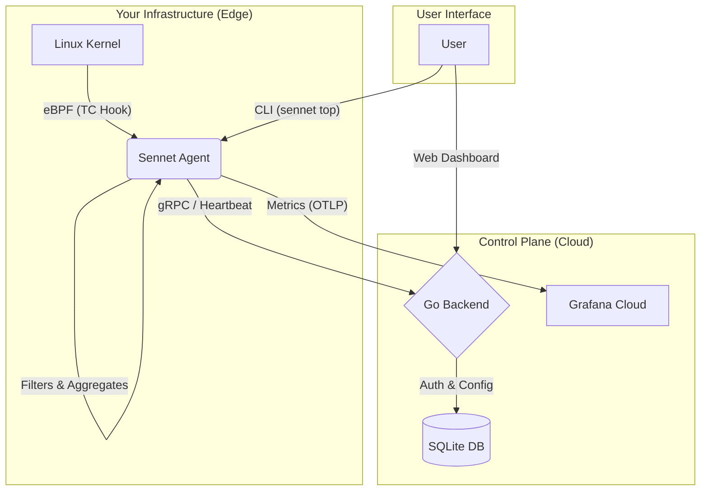

<div align="center">
  
</div>

---

# Sennet (Sentinel Network)


--- 
**Sennet** is a lightweight, eBPF-powered network observability agent designed for the modern cloud. It provides "X-Ray Vision" into your Linux servers, analyzing traffic at the kernel level without performance overhead.

Unlike traditional tools that require complex sidecars or heavy instrumentation, Sennet is a single binary that drops in and starts streaming real-time metrics instantly.

---

## Architecture

Sennet uses a distributed agent-server architecture. The Agent sits on the edge (your servers), hooking into the kernel using **eBPF (Extended Berkeley Packet Filter)** to capture traffic stats with near-zero CPU impact.



---

## Quick Start

You can install Sennet on any supported Linux system (x86_64 or ARM64) with a single command.

### One-Line Install
```bash
curl -sSL [https://raw.githubusercontent.com/MannanSaood/Sennet/main/install.sh](https://raw.githubusercontent.com/MannanSaood/Sennet/main/install.sh) | sudo bash
```

### Manual Installation
If you prefer to install manually, download the latest binary from the [Releases Page](https://github.com/MannanSaood/Sennet/releases).

```bash
# 1. Download
wget [https://github.com/MannanSaood/Sennet/releases/latest/download/sennet-linux-amd64](https://github.com/MannanSaood/Sennet/releases/latest/download/sennet-linux-amd64) -O sennet

# 2. Install
chmod +x sennet
sudo mv sennet /usr/local/bin/

# 3. Start
sudo sennet start
```

---

## CLI Usage

Sennet comes with a built-in CLI for real-time local monitoring.

| Command | Description |
| :--- | :--- |
| `sudo sennet start` | Starts the background service agent. |
| `sudo sennet status` | Checks the health, uptime, and backend connection status. |
| `sudo sennet top` | **Live Matrix Mode:** Shows real-time bandwidth, top flows, and drop rates in your terminal. |
| `sudo sennet upgrade` | Self-updates the binary to the latest version atomically. |

---

## Configuration

Configuration is handled via `/etc/sennet/config.yaml`. The installer generates a default file for you.

```yaml
# /etc/sennet/config.yaml

authentication:
  api_key: "sk_live_xxxxxxxx"  # Your API Key

upstream:
  control_plane: "[https://api.sennet.io](https://api.sennet.io)"
  telemetry_endpoint: "[https://otlp.grafana.net/v1/metrics](https://otlp.grafana.net/v1/metrics)"

agent:
  interface: "auto"   # "auto" detects default route, or specify "eth0"
  log_level: "info"   # debug, info, warn, error
```

---

## Roadmap

| Phase | Feature | Status |
| :--- | :--- | :--- |
| **Phase 1** | **Foundation** (Go Backend, Rust Agent, gRPC) | **Completed** |
| **Phase 2** | **The Core** (eBPF TC Classifier, RingBuf Events) | **Completed** |
| **Phase 3** | **Distribution** (Cross-Compile, CI/CD, Installer) |**Completed** |
| **Phase 4** | **Operations** (CLI `top` view, Self-Updater) | **In Progress** |
| **Phase 5** | **Web UI** (React Dashboard, Agent Management) | *Planned* |

---

## Development

### Prerequisites
* **Rust** (latest stable)
* **Go** (1.21+)
* **Buf** (Protobuf generation)
* **Linux Kernel 5.15+** (Required for CO-RE eBPF)

### Building Locally
```bash
# Clone the repo
git clone [https://github.com/MannanSaood/Sennet.git](https://github.com/MannanSaood/Sennet.git)
cd Sennet

# Build the Agent
cd agent
cargo build --release

# Run the Backend
cd ../backend
go run main.go
```

---

## License

This project is licensed under the **MIT License** - see the [LICENSE](LICENSE) file for details.
