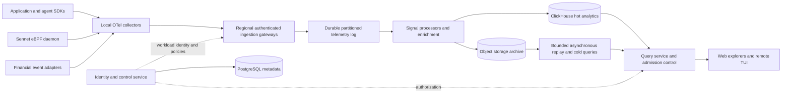

# Sennet target architecture and delivery plan

Status: proposed design, not deployed functionality. Companion: `engineering-audit-2026-09.md`.

## Product direction

Build a correlated observability platform for infrastructure, applications, multi-agent execution, and financial workflows. The differentiator should be following a business outcome through agent decisions, tool calls, application traces and network conditions, with clear provenance and cost. “Bigger than Datadog” is an ambition, not a measurable requirement or current capability.

Do not remove APIs. Replace heartbeat-centric telemetry ingestion with a streaming data plane. Keep versioned APIs for control, query and integration; use standard OpenTelemetry protocols rather than inventing a proprietary replacement for every SDK. eBPF complements application instrumentation; kernel packet counters cannot recover encrypted prompt semantics, order transitions or business causality.

## Boundaries and data flow

- **Edge collection:** batch, redact, enrich with resource identity, disk-backed bounded queue, TLS, retry with jitter and cancellation. Report queue utilization, dropped/rejected records, export age and collection health. A disk full condition must be explicit, never masquerade as zero traffic.
- **Ingestion gateway:** stateless where possible; authenticate workload, derive tenant, validate schema and byte/attribute limits, apply per-tenant quotas, then append to a replicated regional log. Select Kafka-compatible infrastructure after operational/cost evaluation. Never place broker credentials directly in a browser.
- **Acknowledgements:** return durable success only after the configured replicated append succeeds. Local collector acknowledgement is a different boundary and must be documented. At-least-once delivery with idempotent processing; do not promise universal exactly-once semantics.
- **Processors:** independent consumer groups for storage, derived metrics, topology, alerting and evaluation. Partition trace-affine operations by trace ID within tenant; financial ordering by tenant/source/account/entity as required. Do not assume global order. Version transforms and allow bounded replay without duplicating alerts or billing.
- **Storage:** ClickHouse for time-indexed traces/logs/events/flows and benchmarked metric workloads; object storage for compressed raw archives and recovery. Use PostgreSQL for organizations, roles, enrollment, dashboards, alert rules, integration metadata and migrations. Evaluate a dedicated metrics engine only if measured workload requirements warrant its additional complexity.
- **Query:** authorize before planning; mandatory tenant and time bounds, parameterized predicates, row/byte/concurrency budgets, timeout/cancel, cursor pagination, server aggregation/downsampling and partial-result metadata. Separate interactive queries from exports and replay. Cache keys include tenant, permissions, query, time range and schema version.
- **Control:** short-lived workload identity (mTLS/certificate enrollment or scoped tokens), rotation/revocation, SSO/OIDC, organization/workspace roles, secret-manager references and auditable policy changes. Retain API keys only as scoped bootstrap/integration credentials. No shared admin key for every workload.
- **Availability:** regional cells with bounded tenants per cell; replicas across failure domains, independent ingestion/query scaling, tenant migration tooling and explicit residency. Start one region; add regions after proving replay and restore. Avoid a single shared database/log serving every region.

SigNoz documents OTel collection into ClickHouse and a separate query/UI architecture. OTel documents distinct scaling needs by signal and queue/retry/persistent-storage patterns. These support this direction; they do not prove Sennet's performance. See [SigNoz architecture](https://signoz.io/docs/architecture/), [OTel scaling](https://opentelemetry.io/docs/collector/scaling/) and [OTel resiliency](https://opentelemetry.io/docs/collector/resiliency/).

## Event contracts and correlation

Every record needs schema version, trusted tenant/workspace, event ID, source ID, observed time, ingest time, resource/service/environment identity, signal type and bounded attributes. Nanosecond timestamps and large integers must retain precision through JSON/JavaScript boundaries (strings or lossless representations). Source sequence and boot/session ID distinguish duplicates and restarts. All accepted and rejected records must be accountable without logging their sensitive contents.

Use trace/span/parent identifiers and span links for fan-out, fan-in and asynchronous work. Missing parents and late events are normal states, not reasons to invent causality. Keep high-cardinality identifiers in events/spans, not unrestricted metric labels. Enforce tenant cardinality budgets and attribute-size limits at ingestion; quarantine invalid events with retention limits and reason codes.

For **agentic systems**, capture run/session, agent identity and version, workflow, task, model/provider/version, tool invocation, handoff, retry, cancellation, token usage, latency and token price version. Store evaluation results with evaluator/version and sampled provenance. Separate observed cost from estimated cost. Show workflow DAGs, critical path, tool failure/retry storms, loops, parallel branches, token/cost waterfalls, outcome comparisons and queue wait. Content capture should default to metadata; redaction and explicit retention apply before export. Observed tool activity is telemetry, never instructions to the observability system. Evaluate extensions against current OTel GenAI conventions and version them; do not claim a permanently stable convention where upstream is evolving.

Datadog's current agent investigation surface includes trace/span errors, latency, token trends and monitors. That is a useful baseline for feature completeness, not evidence that a graph alone achieves parity: [Datadog investigation documentation](https://docs.datadoghq.com/llm_observability/investigate/).

For **financial workflows**, first support operational monitoring of order/payment/settlement pipelines: source event ID, correlation/transaction ID, sequence, lifecycle state, instrument or payment route, venue/provider, currency, amount represented as decimal/minor units, event and receive timestamps, and reconciliation outcome. Instrument adapters at application/message boundaries. Measure sequence gaps, duplicates, stale prices, event-time delay, rejection rates, unmatched transitions and settlement lag. Support corrections and out-of-order events with versioned reconciliation rules. Show lifecycle timelines, latency distributions, gap monitors, reconciliation queues and exposure to failed dependencies. Observability is not the accounting ledger or trade execution engine. Domain experts must validate monetary precision, lifecycle rules and audit requirements before deployment; this design makes no regulatory compliance claim.

## Visualization and interaction specification

One consistent investigation shell: global time range/timezone, environment/service/tenant scope, query bar, data freshness, saved views, keyboard navigation and shareable URL state. Every view supports loading, empty, stale, partial, denied and failed states. Demo data is explicitly selected and prominently labeled, never automatic fallback.

| Surface | Required behavior | Verification |
|---|---|---|
| Fleet overview | Actual inventory, agent/probe/exporter health, last seen, version, data lag, throughput and loss | Stop collector and gateway separately; distinguish both failure modes |
| Metrics explorer | Counter-reset-aware rates, units, distributions, p50/p95/p99, exemplars, comparison windows | Known fixture data and clock/reset cases reproduce expected calculations |
| Logs/events | Virtualized rows, server filtering, pagination, context, trace links, redaction | Large result set stays responsive; query cancellation stops server work |
| Trace explorer | Search, waterfall, span links, critical path, missing/late span indicators | Fan-out/fan-in and asynchronous fixture preserves causality |
| Service topology | Computed from evidence, rate/error/duration edges, grouping, search, zoom, accessible table alternative | Thousands of services remain navigable without rendering all nodes at once |
| Agent explorer | Session/run DAG, handoffs, tool calls, retries, token/cost/evaluation breakdown | Multi-agent fixture correlates to underlying service/network traces |
| Finance explorer | Event-time lifecycle, gap/reconciliation queue, venue/provider latency histogram | Duplicates/corrections/late events yield expected reconciliation state |
| Dashboards and alerts | Versioned saved queries, variables, linked brushing, burn-rate/SLO monitors, deduplicated routing | Replay does not page twice; user can trace every panel to query and source |

Redesign the marketing site around truthful capabilities, verified onboarding and a clearly separate demo. Replace decorative claims with an install-to-first-signal flow, capabilities/platform matrix, architecture explanation and measured benchmarks. Do not expose team/billing controls until their actual backend workflows exist.

TUI: local diagnostic mode and authenticated remote investigation mode; overview/flows/drops/exporter tabs, measured rates and units, sort/filter/pause, selection drilldown, bounded history, refresh age and compact layouts. Provide `--json` for automation. A terminal RAII guard must restore state on error and panic; support q/Esc/Ctrl-C, resize and non-TTY behavior. No silent simulation. Test synthetic fixtures via an explicit demo mode separately from real collection.

## Capacity model and release gates

These are proposed validation tiers, NOT measured capacities. Choose hardware, retention, payload distribution and dollar budget before claiming any tier.

| Tier | Sustained ingest | Example burst | Mixed-load validation |
|---|---:|---:|---|
| First real vertical slice | 10,000 events/s | 2x for 10 min | 24-hour soak, real queries, collector restart, no unexplained loss |
| Regional production cell | 100,000 events/s | 3x for 10 min | 72-hour soak, tenant skew, consumer/broker failure, restore rehearsal |
| Multiple cells | 1,000,000 events/s aggregate | 2x for 10 min | Regional isolation, tenant migration, independent cell failure and cost report |

At 100,000 events/s and 1 KB/event, raw ingress is about 100 MB/s or 8.64 TB/day (decimal); 30 days is 259.2 TB before replication, indexes and compression. Size from observed bytes, not just event count. An hour of outage buffering at that rate is 360 GB raw, and a 3x burst for ten minutes adds 120 GB above a consumer maintaining baseline throughput. Recovery requires capacity above incoming load. Record compression, replication and query amplification separately.

Candidate initial objectives: durable-append acknowledgement p99 under 1 s, fresh hot data visible p95 under 5 s, representative interactive query p95 under 2 s, and bounded collector CPU/memory overhead measured on reference hosts. Set actual SLOs after profiling, not by copying these values into marketing. Benchmark high-cardinality, large-span, uneven tenant and simultaneous query workloads, not only uniform tiny events.

Failure gates: kill gateway after append but before response; retry duplicates; fill disk; disconnect collectors; pause consumers; inject poison/oversized records; expire credentials mid-stream; fail a replica; replay old data; skew clocks; restore backup to a clean environment. Verify accepted/durable/processed/rejected/dropped counts and distinguish delayed from lost records. Measure RPO/RTO under documented failure assumptions.

## Ordered delivery and migration

1. **Trust and correctness (release blocker):** SEC-01/02 tenant isolation, scoped credential lifecycle, no fake live status, explicit feature availability, reliable errors, schema migrations and repeatable CI. Exit: two-tenant negative tests and real install/heartbeat/query flow pass.
2. **One real telemetry slice:** OTel SDK -> collector -> authenticated gateway -> durable log -> storage writer -> bounded query -> trace explorer. Deliver containerized development stack with pinned versions and one-command fixture ingestion. Exit: duplicates/outage/restart tests and 10k/s tier measured. This is preferable to several disconnected new dashboards.
3. **Unified investigation:** logs/metrics/flows, linked identifiers, time controls, topology, saved dashboards, actual alert evaluation. Fix agent map lifecycle and kernel portability. Exit: same request investigated across all signals; terminal and browser flows verified.
4. **Agent workflows:** versioned run/span conventions, SDK examples, handoff DAG, token/cost and evaluation provenance. Exit: concurrent multi-agent workload with failures/cancellation and bounded cardinality.
5. **Financial operations:** select one concrete payment or order pipeline, implement adapters and reconciliation with domain-reviewed fixtures. Exit: duplicates, corrections, gaps, exact monetary values and out-of-order sequences validated.
6. **Regional scale:** PostgreSQL HA, partition/shard operations, tenant budgets, archive/retention, restore drills and mixed-load tiers. Exit: documented benchmark hardware/cost and failure results; no claims of competitor-scale readiness without this evidence.

Retain the legacy heartbeat endpoint during migration for inventory/commands. Do not route high-volume signals into SQLite as an intermediate scaling strategy. Introduce versioned storage repositories and schemas; migrate metadata with explicit ownership mapping (quarantine unowned legacy records), backups, verification and rollback. Shadow-read migrated queries against fixtures, then migrate one tenant at a time with feature flags. Never blindly dual-write money or billing state without idempotency/reconciliation.

The next implementation milestone is stage 1 plus one complete stage 2 slice. The new architecture requires real integration work; diagrams, compose scaffolding and attractive charts alone are not completion.
