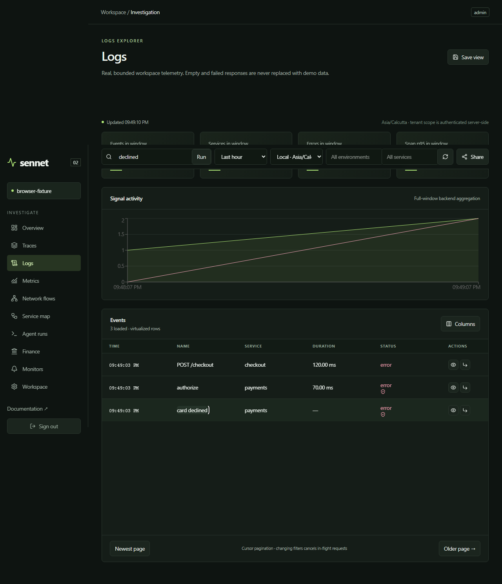
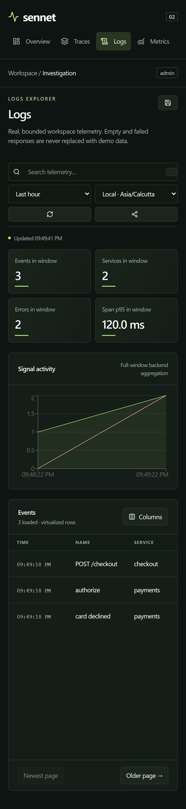

# Investigation UI workstream

Status: implemented frontend investigation foundation on `codex/investigation-ui`. The product never substitutes sample telemetry when a backend request is empty or fails.

## UX behavior

The investigation shell keeps time range, timezone, environment, service, tenant display scope, free-text query, trace, cursor, and pause state in the URL. Changing a scope value replaces the current history entry, clears pagination, and changes the React Query key, which aborts obsolete Axios requests through the provided abort signal. The Share action copies the complete URL. Authenticated workspace ownership remains server-derived; the tenant URL value is display/navigation state and is never sent as authority.

Log and event rows use a fixed-height virtual viewport with overscan, selectable columns, redaction badges, loaded-page trace context, event inspection, and backend cursor pagination. A trace drawer traps focus, restores focus on close, supports Escape, and displays missing parents, explicitly late spans, span links, errors, fan-out/fan-in markers, a deterministic end-time critical path approximation, and counts of related logs and metrics returned by the bounded trace request.

The metrics explorer sends only contract-v1 analytical requests. It supports typed operations, grouping, units, formula labels, exact histogram percentiles, exemplars, comparison windows, execution statistics, budget-partial reasons, and an explicit reset-aware rate explanation. Formula labels are not presented as backend algebra because the current contract executes one operation.

Topology is derived only from parent spans and source/destination attributes in the current bounded event page. It supports service filtering, zoom, prefix clustering, a 100-edge visual cap, and an accessible table containing every derived edge. It does not claim a complete workspace graph.

Dashboard composition provides URL-backed variables, synchronized time state, bounded panel placeholders, inspect-query/source actions, and persistence through the existing dashboard resource. The backend currently stores a latest resource and does not expose immutable version history; the UI states that limitation. Monitor and SLO pages read durable definitions and evaluation state. Fleet health distinguishes stale collectors, reported queueing, exporter/gateway errors, and reported storage delay, while explicitly identifying the missing user-facing pipeline-health contract.

Loading, empty, denied, stale, partial, and failed states are shared and visually distinct. Responsive navigation, horizontal data access, focus rings, semantic tables/dialogs, sufficient dark-theme contrast, and `prefers-reduced-motion` behavior are included.

## Browser evidence

Playwright uses explicit route fixtures labelled `browser-fixture`; these fixtures are test-only and cannot become a runtime fallback. Coverage includes URL filtering, cursor pagination, trace drilldown, saved dashboards, analytical partial state, failed requests, keyboard dialog focus/Escape behavior, and mobile layout.

## Verification

- `npm run lint`: pass.
- `npm run build`: pass; route-level lazy loading plus explicit React, charts, Firebase, and Markdown vendor chunks.
- `npm run test:browser`: 10 passed across Desktop Chrome and Pixel 7 profiles, including the server topology, formula/histogram, dashboard-version, pipeline-health, and notification-status paths (the desktop project intentionally skips the mobile-only capture case).

Largest final production chunks (uncompressed) are charts 368,421 B, Markdown core 333,942 B, React core 292,272 B, app index 196,819 B, syntax highlighting 169,943 B, and Firebase 109,366 B. No generated chunk exceeds Vite's 500 KB warning threshold. Charts are capped by the backend at 300 points and the UI limits visible topology edges to 100 while retaining the table alternative.

## Closed visualization and contract gaps

- Topology now uses a server-side, tenant-scoped 100,000-record scan, aggregation before rendering, 500-edge cursor pages, partial reasons, clustering, zoom, filtering, and a complete table for each returned page.
- Dashboard writes now create immutable snapshots. Panel definitions, variables, synchronized time, and linked-brush state are persisted and previous versions can be restored.
- Analytical queries now validate and execute bounded scalar formulas server-side. Histograms return real bucket bounds/counts alongside exact percentiles.
- Dedicated trace/correlation responses now return canonical critical-path flags, clock-skew detection, span-link arrays, missing/late markers, fan-in/fan-out counts, and separately bounded related logs and metrics.
- Admin-only pipeline health exposes real collector-admission, gateway, storage-queue, and analytics-storage counters without exposing the operator token. Fleet inventory remains workspace scoped.
- Notification status now exposes tenant-filtered pending and provider-acknowledged outbox counts. `provider_configured: false` remains explicit because no dispatcher is installed; the UI never equates durable enqueue with delivery.

All new contracts remain intentionally bounded. Reaching a topology or trace scan cap produces explicit partial metadata; it never implies that omitted telemetry does not exist.
